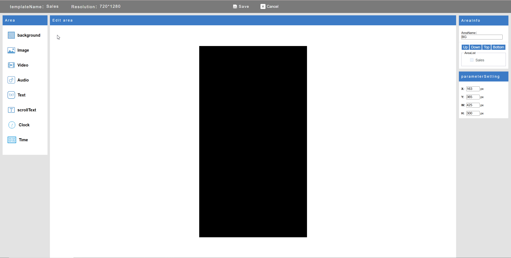

# EasyDisplay

  

**EasyDisplay（イージーディスプレイ）** は、ミニマルかつオフラインファーストなデジタルサイネージソリューションです。

- ✅ **ローカル優先アーキテクチャ** — インターネット不要で動作
- 📱 **クロスプラットフォーム対応** — Android、Windows、Linux、iOS
- 🛠️ **で拡張が簡単**
- 📦 **会議室ディスプレイ**、**店舗の販促表示**、**情報パネル** に最適

---

## 🚀 はじめに

EasyDisplay をインストールすると、ローカルサーバーが起動し、ブラウザから直接コンテンツ管理が可能になります。
クラウド設定は不要です。

### ステップ 1: インストール & 起動

アプリをインストールして、デバイス上で起動します。

  

### ステップ 2: ブラウザでアクセス

ブラウザを開き、以下にアクセスしてください:
http://[デバイスのIP]:[ポート番号]

### ステップ 3: コンテンツ編集

  

画面のコンテンツをリアルタイムで編集・更新できます。

### ステップ 4: 📺 スクリーンへ即時反映

コンテンツを瞬時にスクリーンへ表示。

  

詳細な使用方法は [EasyDisplay ユーザーガイド](https://sites.google.com/view/shiningtech/how-to-use) をご覧ください。

---

## 🎨 カスタムレイアウト（ドラッグ＆ドロップ）

直感的なドラッグ＆ドロップエディターで、自由にコンテンツをデザインできます。
プログラミング知識は不要です。

---

## 🖥️ 利用シーン

### 🍽️ レストランのメニューボード

  

### 🛍️ 店舗の販促表示

  

  

### 📰 情報スクリーン

  

---

## 📲 アプリの入手

EasyDisplay は Google Play で配信中：

  

---

## 📄 ライセンス

本ソフトウェアは **GNU Affero General Public License v3.0 (AGPLv3)** の下でライセンスされています。
詳しくは [LICENSE](./LICENSE) をご確認ください。
