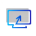
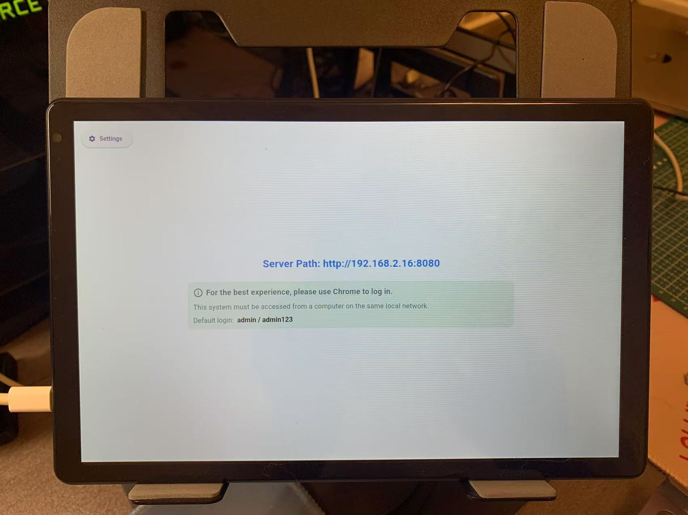
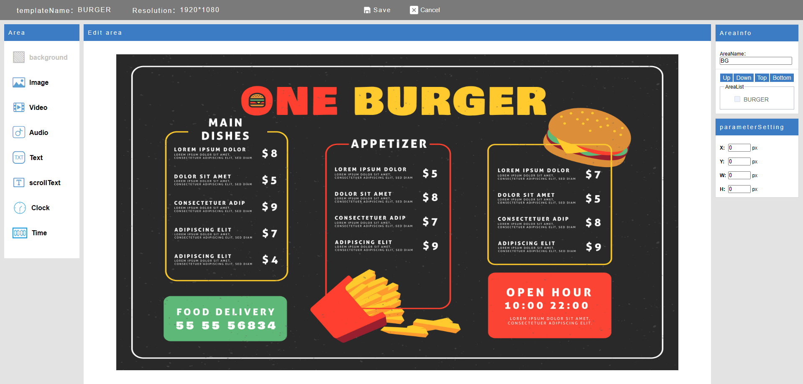
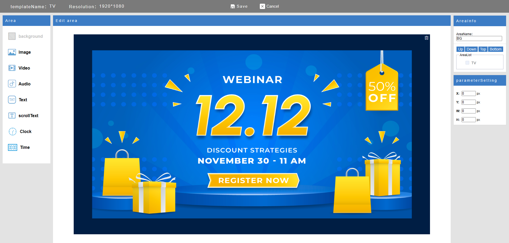
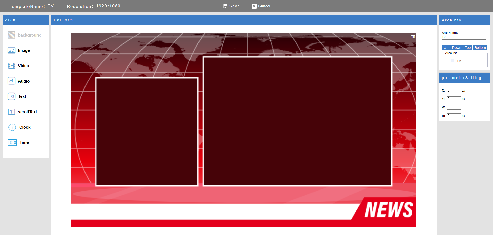
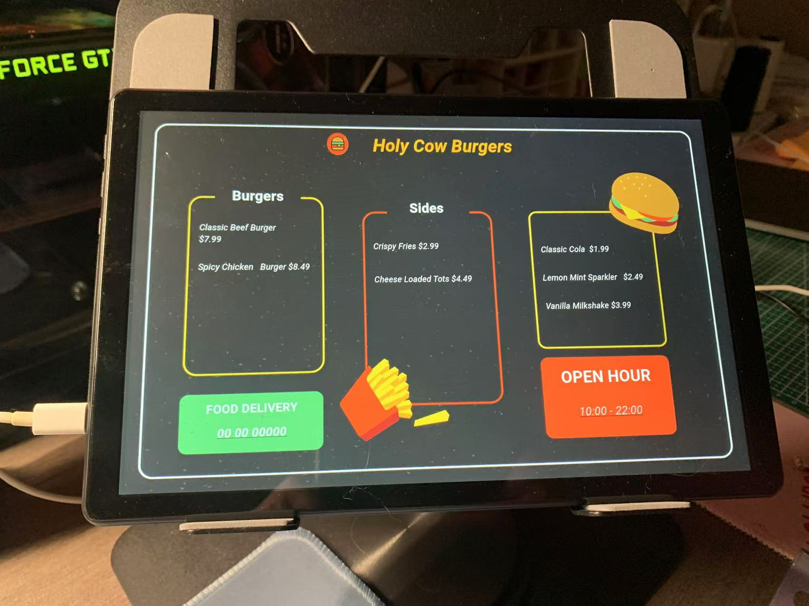

# EasyDisplay

📘 [English](./README.md) | [繁體中文](./README.zh-TW.md)

  

**EasyDisplay** は、ミニマルでオフライン対応のデジタルサイネージソリューションです。

- ✅ **ローカルファースト設計** — インターネット不要で動作
- 📱 **マルチプラットフォーム対応** — Android、Windows、Linux、iOS
- 🛠️ **完全オープンソース**、カスタマイズしやすい
- 📦 会議室、店舗、情報掲示板などに最適

---

## 🚀 はじめに

EasyDisplay をインストールすると、デバイス上にローカルサーバーが立ち上がり、ブラウザからコンテンツを編集・配信できます。クラウド設定は不要です。

### ステップ 1：インストールと起動

アプリをインストールし、デバイスで起動します。

  

### ステップ 2：ブラウザでアクセス

ブラウザで以下のようにアクセス： http://[device-ip]:[port]

リアルタイムで画面コンテンツの管理・更新が可能です。

---

## 🖥️ 利用シーン

### 🍽️ レストランのメニューボード

  

### 🛍️ 店舗プロモーション

  

### 📰 情報掲示板

  

---

## 📺 画面にプッシュ表示

編集したコンテンツを即時に表示可能です。

  

詳しい使い方は  
[EasyDisplay ユーザーガイド](https://sites.google.com/view/shiningtech/how-to-use) をご覧ください。

---

## 🎨 自由レイアウト（ドラッグ&ドロップ対応）

コード不要。直感的なドラッグ＆ドロップで、自由にレイアウトをデザインできます。

---

## 📲 アプリを入手

EasyDisplay は Google Play で公開中：

  

---

## 📄 ライセンス

本プロジェクトは **GNU Affero General Public License v3.0 (AGPLv3)** に基づいてライセンスされています。  
詳しくは [LICENSE](./LICENSE) をご確認ください。

