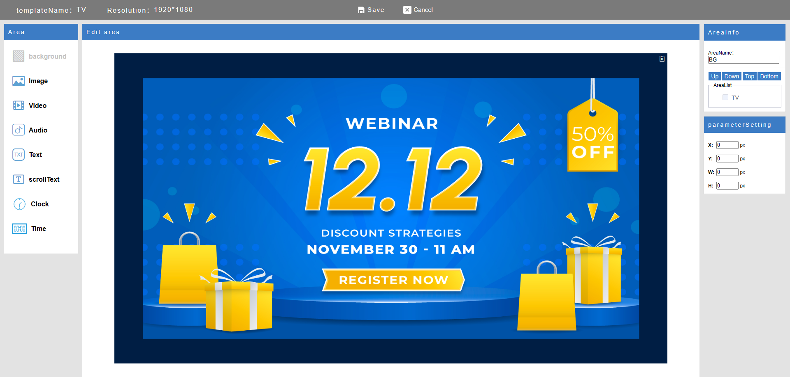

# EasyDisplay

  

**EasyDisplay** is a minimalist, offline-first digital signage solution.

- ✅ **Local-first architecture** — works without internet
- 📱 **Cross-platform support** — Android, Windows, Linux
- 🛠️ **Fully open-source** and easy to extend
- 📦 Ideal for **meeting room displays**, **retail signs**, and **info panels**

---

## 🚀 Getting Started

Once installed, EasyDisplay runs a local server that lets you control content directly from any browser — no cloud setup required.

### Step 1: Install & Launch

Install the app and start the program on your device.

  

### Step 2: Open Browser

Open your browser and visit: http://[device-ip]:[port]

to manage and update the screen content in real-time.

---

## 🖥️ Use Cases

### 🍽️ Restaurant Menu Boards

  

### 🛍️ Store Promotions

  

### 📰 Info Screens

  

---

## 📺 Push to Screen

Display content instantly on screens.

  

For full usage instructions, see the [EasyDisplay User Guide](https://sites.google.com/view/shiningtech/how-to-use).

---

## 📄 License

Licensed under the **GNU Affero General Public License v3.0 (AGPLv3)**.  
See [LICENSE](./LICENSE) for full terms.
