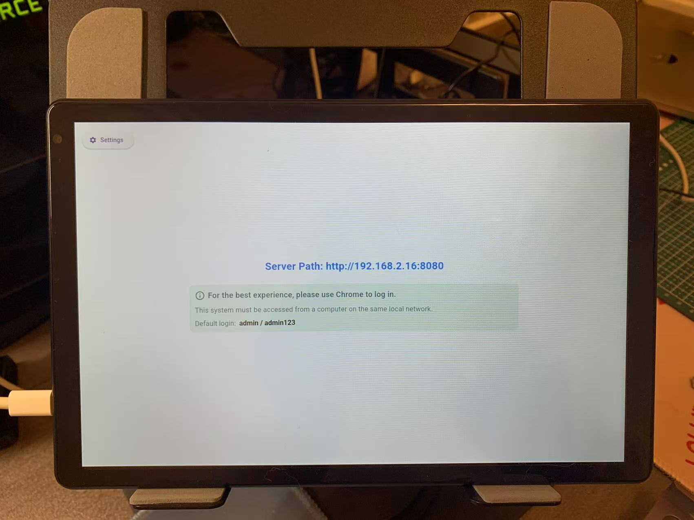

# EasyDisplay

  

**EasyDisplay** 是一款极简、离线优先的数字标牌解决方案。

- ✅ **本地优先架构** — 无需联网也能使用
- 📱 **跨平台支持** — 支持 Android、Windows、Linux、iOS
- 🛠️ **易于扩展和自定义**，
- 📦 适用于 **会议室信息屏**、**零售广告屏** 和 **信息展示屏**

---

## 🚀 快速开始

安装完成后，EasyDisplay 会启动一个本地服务，你可以通过任意浏览器访问它来管理内容。
无需配置云端，即装即用。

### 第一步：安装与启动

将应用安装到你的设备并启动。

  

### 第二步：打开浏览器

在浏览器中输入网址：
http://[设备IP]:[端口号]

### 第三步：编辑节目内容

  

即可实时更新和管理屏幕内容。

### 第四步：📺 实时推送到屏幕

一键将内容推送到显示设备，快速响应。

  

完整使用说明请见：[EasyDisplay 用户指南](https://sites.google.com/view/shiningtech/how-to-use)
---

## 🎨 自由布局（拖拽编辑）

通过直观的拖拽编辑器，自由设计屏幕内容，无需编程知识。

---

## 🖥️ 应用场景

### 🍽️ 餐厅菜单屏

  

### 🛍️ 店铺促销展示

  

  

### 📰 信息展示屏

  

---

## 📲 下载应用

EasyDisplay 已上架 Google Play：

  

---

## 📄 开源协议

本项目基于 **GNU Affero General Public License v3.0 (AGPLv3)** 开源。
详情请查看 [LICENSE](./LICENSE) 文件。
