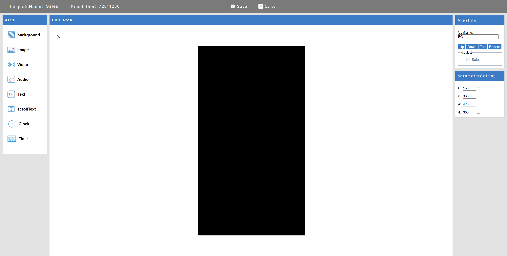
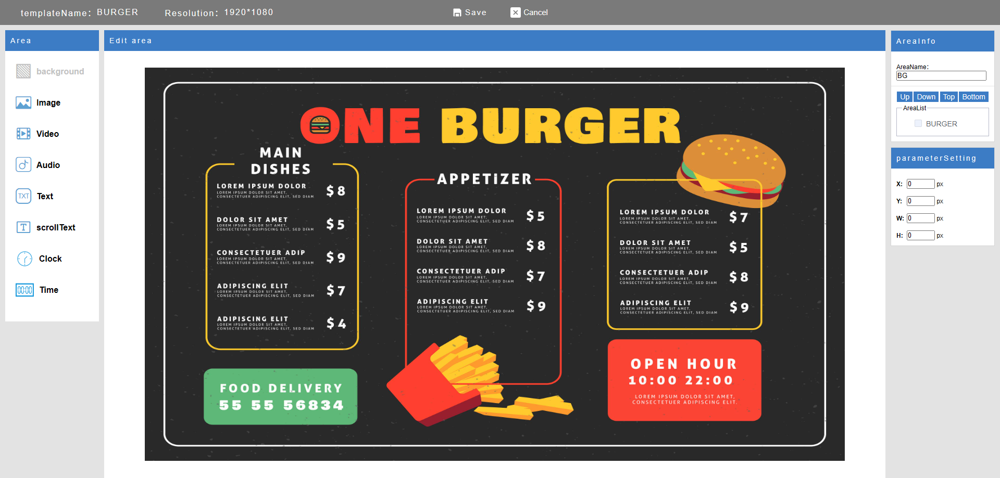
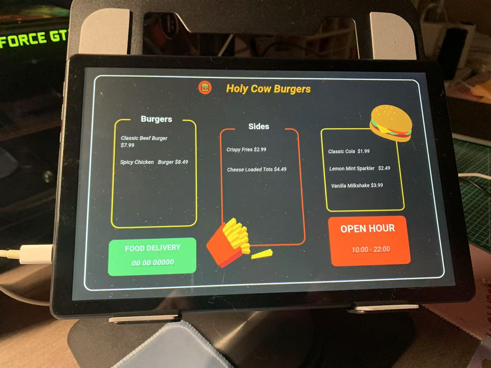

# EasyDisplay

  

**EasyDisplay** 是一套簡約、離線優先的數位看板解決方案。

- ✅ **本地優先架構** — 無需網路也能運作
- 📱 **跨平台支援** — Android、Windows、Linux、iOS
- 🛠️ **完全開源**，易於擴充
- 📦 適用於 **會議室顯示器**、**商店促銷牌**、**資訊看板**

---

## 🚀 快速開始

安裝後，EasyDisplay 會啟動一個本地伺服器，讓你透過瀏覽器直接管理畫面內容 — 無需設定雲端服務。

### 第一步：安裝與啟動

將應用程式安裝至裝置，啟動後即可使用。

  

### 第二步：打開瀏覽器

在瀏覽器中輸入網址：
http://[裝置IP]:[連接埠]

### 第三步：編輯節目內容

  

可即時編輯與更新螢幕顯示內容。

---

## 🖥️ 應用場景

### 🍽️ 餐廳菜單看板

  

### 🛍️ 店面促銷海報

  

  

### 📰 資訊展示牆

  

---

## 📺 即時推送畫面

可立即將內容推送至螢幕顯示。

  

完整使用說明，請參考 [EasyDisplay 使用指南](https://sites.google.com/view/shiningtech/how-to-use)。

---

## 🎨 自由排版（拖放編輯）

透過直覺式拖曳編輯器，輕鬆設計顯示內容 — 無需程式知識。

---

## 📲 下載應用程式

EasyDisplay 已上架 Google Play：

  

---

## 📄 授權條款

本專案採用 **GNU Affero General Public License v3.0 (AGPLv3)** 授權。
詳細內容請參閱 [LICENSE](./LICENSE)。
