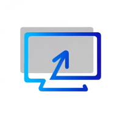
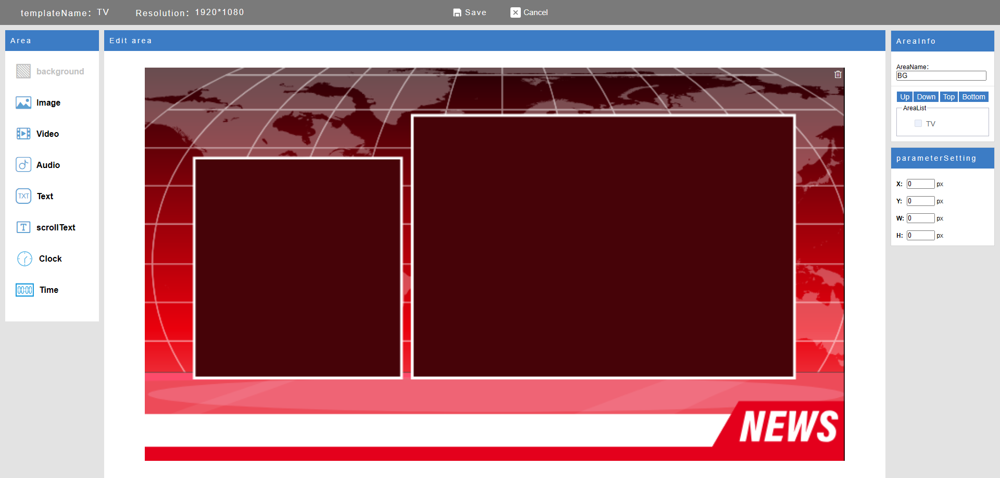

# EasyDisplay

  

**EasyDisplay** 是一款極簡風格、離線優先的數位看板（Digital Signage）解決方案。

- ✅ **本地優先架構** — 無需網路即可運行
- 📱 **跨平台支援** — Android、Windows、Linux、iOS
- 🛠️ **完全開源**，擴充容易
- 📦 適用於 **會議室門口看板**、**商店促銷螢幕**、**資訊佈告螢幕**

---

## 🚀 快速開始

安裝後，EasyDisplay 將在裝置上啟動本地伺服器，可透過任何瀏覽器進行內容編輯與推送，無需雲端設定。

### 第一步：安裝與啟動

安裝應用程式並啟動。

  

### 第二步：打開瀏覽器

在瀏覽器中輸入網址：http://[device-ip]:[port]

即可即時管理並更新螢幕顯示內容。

---

## 🖥️ 使用場景

### 🍽️ 餐廳電子菜單看板

  

### 🛍️ 商店促銷看板

  

### 📰 資訊發布螢幕

  

---

## 📺 推送到螢幕

將內容即時推送至顯示螢幕上。

  

詳細使用說明請參閱  
[EasyDisplay 使用教學](https://sites.google.com/view/shiningtech/how-to-use)

---

## 🎨 自由設計（拖放編輯）

透過直覺式拖放編輯器，自由設計顯示內容 — 完全不需要撰寫程式碼。

---

## 📲 下載應用程式

EasyDisplay 現已上架 Google Play 商店：

  

---

## 📄 授權條款

本專案採用 **GNU Affero General Public License v3.0 (AGPLv3)** 開源授權。  
詳情請參閱 [LICENSE](./LICENSE)。

